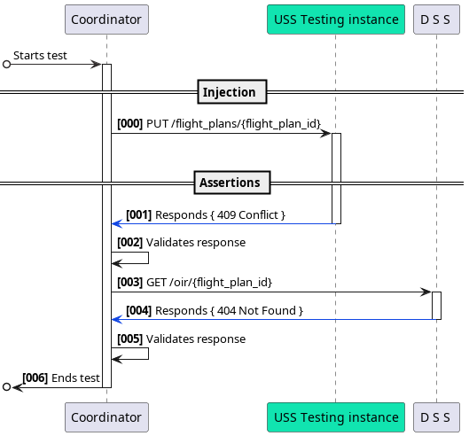

### **1. Identifier:** `TC-CSP-01`

### **2. Title:** `Validation of constraint awareness`

### **3. Summary**

Verifies that the system correctly consumes constraints and provides situational awareness per ASTM F3548.

### **4. ASTM Standard(s) Referenced**

-   **ASTM F3548-21**: Section 5.8.2.1 (Constraint Processing) - **CSTP0005:** USS shall notify UAS personnel or the operator's automation system, providing the details of all constraints that intersect that operational intent.

### **5. Scenario/Setup**

-   **System Under Test (SUT)**: `USS Testing Instance`
-   **Participants**:
    -   `Test Coordinator`
    -   `USS Testing Instance`
    -   `DSS` (Discovery and Synchronization Service).
-   **Prerequisites**:
    -   Flight plan request body specifies area conflicting with other OIR (by time or space)

### **6. Test Steps**

**- Sequence Diagram** (Visual Flow):

**Textual Steps**:

| Step | Action                                                  |
| ---- | ------------------------------------------------------- |
| 1    | Coordinator injects a flight plan via request.          |
| 2    | USS rejects request with `409 Conflict`.                |
| 3    | Coordinator validates response status code and message. |
| 4    | Coordinator queries DSS for OIR.                        |
| 5    | Coordinator validates response status code and message. |

### **7. Pass/Fail Criteria**

-   **Pass**:
    -   USS returns `409` for conflicting flight plans.
    -   DSS returns `404` for non-existent OIR.
    -   Error responses include structured JSON.
-   **Fail**:
    -   USS accepts invalid flight plan (`200 OK`).
    -   Missing/incorrect error payloads.

### **8. Expected Outcome**

-   Flight plan rejection (`409 Conflict`).
-   DSS confirms OIR absence (`404 Not Found`).
-   Full compliance with ASTM F3548-21 error handling.
