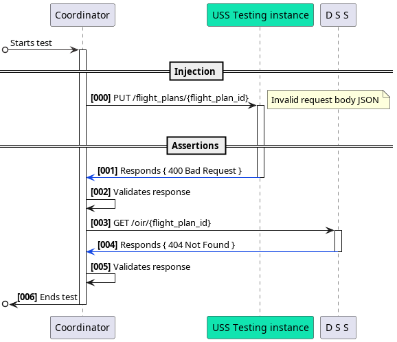

### **1. Identifier:** `TC-OIR-001`

### **2. Title:** `Validation of OIR Request Body`

### **3. Summary**

Verifies that the system correctly rejects invalid flight
plans and handles OIR queries per ASTM F3548.

### **4. ASTM Standard(s) Referenced**

-   **ASTM F3548-21**: Section 5.3.2.4 (Operational
    Intent Creation, Modification, and Deletion) -
    **OPIN0020**.

### **5. Scenario/Setup**

-   **System Under Test (SUT)**: `USS Testing Instance`
-   **Participants**:
    -   `Test Coordinator`
    -   `USS Testing Instance`
    -   `DSS` (Discovery and Synchronization Service).
-   **Prerequisites**:
    -   Flight plan request body with total number
        of polygon vertices invalid
    -   DSS service configured to reject invalid body
        requests and respond `400 Bad Request`

### **6. Test Steps**

**- Sequence Diagram** (Visual Flow):

**Textual Steps**:

| Step | Action                                                  |
| ---- | ------------------------------------------------------- |
| 1    | Coordinator injects an invalid flight plan via request. |
| 2    | USS rejects request with `400 Bad Request`.             |
| 3    | Coordinator validates response status code and message. |
| 4    | Coordinator queries DSS for OIR                         |
| 5    | Coordinator validates response status code and message  |

### **7. Pass/Fail Criteria**

-   **Pass**:
    -   USS returns `400` for invalid flight plans.
    -   DSS returns `404` for non-existent OIR.
    -   Error responses include structured JSON.
-   **Fail**:
    -   USS accepts invalid flight plan (`200 OK`).
    -   DSS returns `200 OK` with dummy OIR.
    -   Missing/incorrect error payloads.

### **8. Expected Outcome**

-   Flight plan rejection `400 Bad Request`.
-   DSS confirms OIR absence (`404 Not Found`).
-   Full compliance with ASTM F3548-21 error handling.
